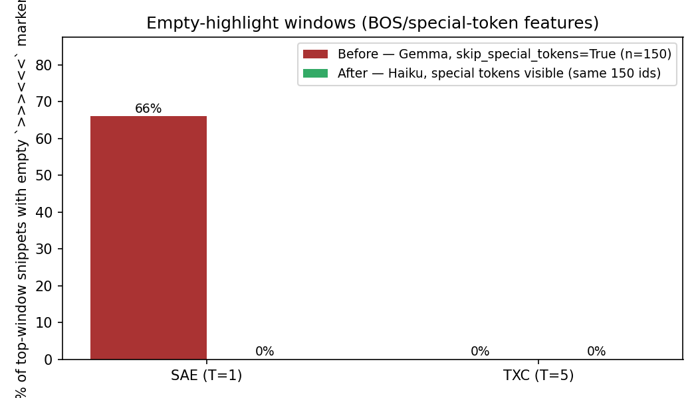
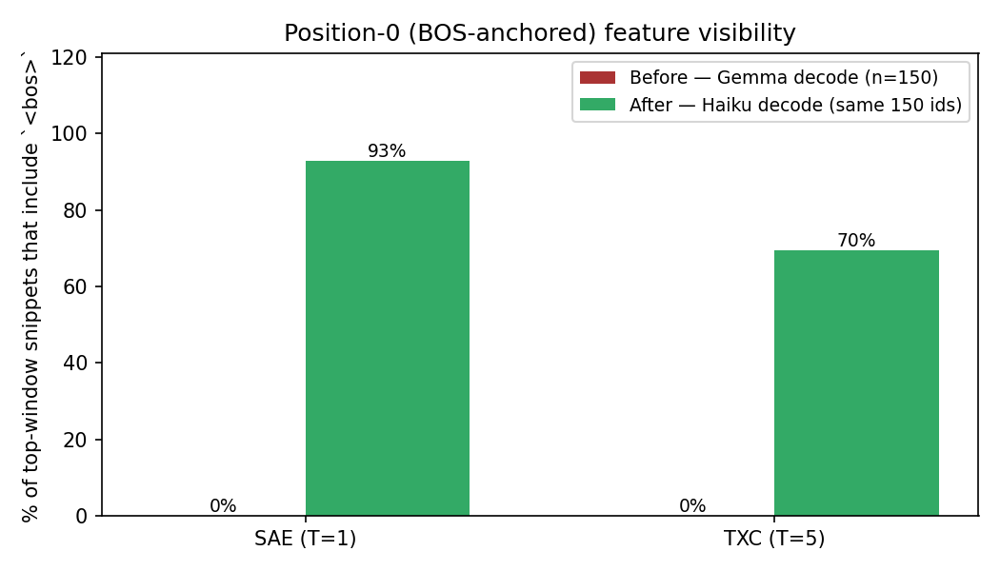

# Autointerp report — SAE vs TXC (Haiku rerun)

Drop-in regeneration of the SAE (T=1) and TXC (T=5) feature explanations with two changes:
1. `TextContext.get_window_text` now decodes with `skip_special_tokens=False`, so windows that fire on `<bos>` / `<start_of_turn>` / `<end_of_turn>` no longer present an empty `>>><<<` highlight to the explainer.
2. The explainer is **claude-haiku-4-5-20251001** (async, semaphore=8) instead of the local `google/gemma-2-2b-it` fallback.

TSAE was deliberately not rerun — same checkpoints / k / T / top-features as the original three-arm run, so this is apples-to-apples.

## Headline numbers

Apples-to-apples comparison: same 150 feature IDs explained by Gemma (before) vs Haiku with special tokens visible (after). Plus, the full Haiku dictionary count.

| arm | full-dict n | empty-window % (Gemma 150 → Haiku 150) | BOS-visible % (Gemma 150 → Haiku 150) | mean explanation length (Gemma → Haiku, same 150) |
|-----|------------:|----------------------------------------:|-------------------------------------:|--------------------------------------------------:|
| SAE (T=1) | 2129 | 66.0% → **0.0%** | 0.0% → **92.8%** | 87 → 266 chars |
| TXC (T=5) | 5033 | 0.0% → **0.0%** | 0.0% → **69.5%** | 137 → 239 chars |

## Safety-tag distribution (Haiku, current)

Counts and within-arm percentages over the full active dictionary interpreted by Haiku.

| arm | NONE | REFUSAL | DECEPTION | HARMFUL_CONTENT | BIAS | total |
|-----|-----:|--------:|----------:|----------------:|-----:|------:|
| SAE (T=1) | 2118 (99.5%) | 0 (0.0%) | 0 (0.0%) | 9 (0.4%) | 2 (0.1%) | 2129 |
| TXC (T=5) | 4991 (99.2%) | 2 (0.0%) | 6 (0.1%) | 27 (0.5%) | 7 (0.1%) | 5033 |

## Special-token features (now visible)

Features whose top windows fire on a special token (`<bos>`, `<start_of_turn>`, `<end_of_turn>`, …). Before the fix, Gemma saw these as empty `>>><<<` markers and confidently labeled them with whatever surrounding content existed. The Gemma column shows the old explanation for the same `feat_id` for context.

### SAE (T=1)

| feat | Gemma explanation | Haiku explanation | example window |
|------|-------------------|-------------------|----------------|
| 17453 | This feature represents locations, specifically places and businesses. | This feature activates on beginning-of-sequence tokens followed by generic, informational opening phrases typ… | `>>><bos><<<This vehicle paper model is a 194` |
| 12266 | This feature represents locations, specifically places and businesses. | This feature detects the beginning-of-sequence token (<bos>) immediately followed by diverse, encyclopedic or… | `>>><bos><<<This vehicle paper model is a 194` |
| 11642 | This feature represents locations, specifically places and businesses. | This feature activates at the beginning of text sequences (immediately after <bos>) that introduce factual, i… | `>>><bos><<<This vehicle paper model is a 194` |
| 627 | This feature represents locations, specifically places and businesses. | This feature activates on beginning-of-sequence tokens that introduce generic, factual, or commercial text—su… | `>>><bos><<<This vehicle paper model is a 194` |
| 4136 | This feature represents locations, specifically places and businesses. | This feature activates on beginning-of-sequence tokens followed by text opening patterns typical of web artic… | `>>><bos><<<This vehicle paper model is a 194` |
| 3963 | This feature represents locations, specifically places associated with businesses or services. | This feature activates on the beginning-of-sequence token (<bos>) immediately followed by diverse, everyday i… | `>>><bos><<<This vehicle paper model is a 194` |
| 149 | This feature represents locations, specifically places and businesses. | This feature activates on the beginning-of-sequence token (<bos>) immediately followed by diverse, factual op… | `>>><bos><<<This vehicle paper model is a 194` |
| 3793 | This feature represents locations, specifically places and businesses. | This feature activates on the beginning-of-sequence token immediately followed by diverse, generic opening te… | `>>><bos><<<This vehicle paper model is a 194` |

### TXC (T=5)

| feat | Gemma explanation | Haiku explanation | example window |
|------|-------------------|-------------------|----------------|
| 1004 | This feature represents the presence of a statement indicating a personal experience or accomplishment, often… | This feature activates on first-person narrative openings that transition from self-description or personal s… | `>>><bos>I have a somewhat<<< fancy tv that supports an external wi-fi module` |
| 2720 | This feature represents positive, confident statements about completion, timeliness, and budget adherence. | This feature activates on temporal and date-related information, particularly dates, times, year ranges, and … | `>>><bos>Date: Monday <<<11 April, 2016` |
| 13249 | This feature represents the presence of specific dates or timeframes, often in the context of news, events, o… | This feature tracks the beginning of news articles, web content headers, and published text fragments—specifi… | `>>><bos>Sault Ste.<<< Marie hot stone spa Jump to. Accessibility Help` |
| 11361 | This feature represents titles of books, articles, or websites related to self-improvement, business, or tech… | This feature activates on proper nouns and branded names (company names, product titles, band names, game tit… | `>>><bos>At LuvBuds<<< we strive to be ahead of the curve when buying` |
| 2890 | This feature represents situations where a person or group is denied a service or benefit, often due to preju… | This feature activates on search query titles, webpage headers, and content introductions that appear at the … | `>>><bos>Apple cake using apple<<< pie filling Recipes / Apple cake using apple pie` |
| 7347 | This feature represents events or topics that are associated with a sense of injury, success, or achievement.… | This feature activates on the beginning of news article headlines and article openings, particularly those wi… | `>>><bos>Personal Growth - Make<<< a habit of it ! Ashish Virmani` |
| 18396 | This feature represents a topic of discussion or a concept that is frequently mentioned in relation to a spec… | This feature activates on the beginning of straightforward, declarative statements that introduce a topic or … | `>>><bos>Ballet is an<<< artistic dance form performed to music, using precise and` |
| 1511 | This feature represents the presence of a specific organization, institution, or entity name. | This feature activates on the beginning of sentences that introduce specific named entities or proper nouns (… | `>>><bos>The Quad Cities area<<< is blessed with two local mosques or masajids.` |

## SAE vs TXC contrast — top-12 most-active features

Features ranked by total activation mass. Two example windows per feature, truncated for readability.

### SAE (T=1) — top-12

| feat | safety | explanation | top windows |
|------|--------|-------------|-------------|
| 17453 | NONE | This feature activates on beginning-of-sequence tokens followed by generic, informational opening phrases typical of web content—headlines,… | `>>><bos><<<This vehicle paper model is a 194`   `>>><bos><<<Saturday, September 12, 20` |
| 12266 | NONE | This feature detects the beginning-of-sequence token (<bos>) immediately followed by diverse, encyclopedic or factual opening content (prod… | `>>><bos><<<This vehicle paper model is a 194`   `>>><bos><<<Saturday, September 12, 20` |
| 11642 | NONE | This feature activates at the beginning of text sequences (immediately after <bos>) that introduce factual, informational, or promotional c… | `>>><bos><<<This vehicle paper model is a 194`   `>>><bos><<<Saturday, September 12, 20` |
| 627 | NONE | This feature activates on beginning-of-sequence tokens that introduce generic, factual, or commercial text—such as product descriptions, ne… | `>>><bos><<<This vehicle paper model is a 194`   `>>><bos><<<Saturday, September 12, 20` |
| 4136 | NONE | This feature activates on beginning-of-sequence tokens followed by text opening patterns typical of web articles, product descriptions, new… | `>>><bos><<<This vehicle paper model is a 194`   `>>><bos><<<Saturday, September 12, 20` |
| 3963 | NONE | This feature activates on the beginning-of-sequence token (<bos>) immediately followed by diverse, everyday informational text fragments—pr… | `>>><bos><<<This vehicle paper model is a 194`   `>>><bos><<<Saturday, September 12, 20` |
| 149 | NONE | This feature activates on the beginning-of-sequence token (<bos>) immediately followed by diverse, factual opening text across multiple dom… | `>>><bos><<<This vehicle paper model is a 194`   `>>><bos><<<Saturday, September 12, 20` |
| 3793 | NONE | This feature activates on the beginning-of-sequence token immediately followed by diverse, generic opening text—news articles, product desc… | `>>><bos><<<This vehicle paper model is a 194`   `>>><bos><<<Saturday, September 12, 20` |
| 11378 | NONE | This feature activates on the beginning-of-sequence token (<bos>) followed by diverse introductory content types, detecting the onset of ne… | `>>><bos><<<This vehicle paper model is a 194`   `>>><bos><<<Saturday, September 12, 20` |
| 7407 | NONE | This feature activates at the beginning of sequences (post-<bos>) that start with factual, informational, or commercial content—product des… | `>>><bos><<<This vehicle paper model is a 194`   `>>><bos><<<Saturday, September 12, 20` |
| 11216 | NONE | This feature activates on the beginning-of-sequence token (<bos>) followed by diverse, factual opening passages from news articles, product… | `>>><bos><<<This vehicle paper model is a 194`   `>>><bos><<<Saturday, September 12, 20` |
| 7758 | NONE | This feature fires on the beginning-of-sequence token (<bos>) followed by diverse factual, informational, or commercial opening phrases—pro… | `>>><bos><<<This vehicle paper model is a 194`   `>>><bos><<<Saturday, September 12, 20` |

### TXC (T=5) — top-12

| feat | safety | explanation | top windows |
|------|--------|-------------|-------------|
| 1004 | NONE | This feature activates on first-person narrative openings that transition from self-description or personal statements into specific conten… | `>>><bos>I have a somewhat<<< fancy tv that supports an external wi-fi module`   `>>><bos>I have to say<<< that the speakers at the Science and Society Conference,` |
| 2720 | NONE | This feature activates on temporal and date-related information, particularly dates, times, year ranges, and temporal markers that appear a… | `>>><bos>Date: Monday <<<11 April, 2016`   `>>><bos>9 April 2<<<019 - "Here I am, send` |
| 13249 | NONE | This feature tracks the beginning of news articles, web content headers, and published text fragments—specifically detecting the opening to… | `>>><bos>Sault Ste.<<< Marie hot stone spa Jump to. Accessibility Help`   `>>><bos>The Communications Decency<<< Act of 1996 (CDA)` |
| 11361 | NONE | This feature activates on proper nouns and branded names (company names, product titles, band names, game titles) that appear at the beginn… | `>>><bos>At LuvBuds<<< we strive to be ahead of the curve when buying`   `>>><bos>Cinch Connectivity Solutions<<< (CCS) has been named the 20` |
| 2890 | NONE | This feature activates on search query titles, webpage headers, and content introductions that appear at the beginning of documents—essenti… | `>>><bos>Apple cake using apple<<< pie filling Recipes / Apple cake using apple pie`   `>>><bos>Personal Loan In Chennai<<< The capital city of Tamil Nadu, Chennai lies` |
| 7347 | NONE | This feature activates on the beginning of news article headlines and article openings, particularly those with location tags, datelines, o… | `>>><bos>Personal Growth - Make<<< a habit of it ! Ashish Virmani`   `>>><bos>In Peru, a<<< suspecting husband filmed his own wife in bed with` |
| 18396 | NONE | This feature activates on the beginning of straightforward, declarative statements that introduce a topic or subject with a neutral, inform… | `>>><bos>Ballet is an<<< artistic dance form performed to music, using precise and`   `>>><bos>Romance novels are known<<< for heaving bosoms, but these photos from People` |
| 1511 | NONE | This feature activates on the beginning of sentences that introduce specific named entities or proper nouns (organizations, places, people,… | `>>><bos>The Quad Cities area<<< is blessed with two local mosques or masajids.`   `>>><bos>The FiRa Consortium<<< has just been established by the ASSA ABLOY` |
| 15506 | NONE | This feature activates on text segments immediately following beginning-of-sequence tokens or natural sentence breaks, capturing the onset … | `>>><bos>Your greatest asset in<<< life is your Health. Immediate cover when you`   `>>><bos>There are instances when<<< a person gets injured because of the negligence of an…` |
| 17051 | NONE | This feature detects editorial and meta-textual framing statements that introduce content restrictions, format specifications, source attri… | `>>><bos>Letter to the editor<<< – vote no on Question 2 I am`   `>>><bos>The summary should be<<< 3 pages long. 5-6 body` |
| 4278 | NONE | This feature activates on the beginning-of-sequence token (<bos>) followed by introductory or framing phrases that establish context, annou… | `>>><bos>Just how to Compose<<< the Excellent Essay Intro Writing an ideal essay introduct…`   `>>><bos>You are not logged<<< in. (Log in • Create account)` |
| 16845 | NONE | This feature activates on product titles, headings, and document headers that are cut off or truncated mid-word or mid-phrase, typically ap… | `>>><bos>Natec Lobster -<<< notebook security cable: convenient code operated barrel lock …`   `>>><bos>Endoscope Repro<<<cessing and Infection Control - An endoscope` |

## Random sample (mid-dictionary)

20 features drawn at random from each arm's full Haiku-interpreted set, to spot-check explanation quality outside the top-N tail.

### SAE (T=1) — 20 random

| feat | safety | explanation | top windows |
|------|--------|-------------|-------------|
| 16770 | NONE | This feature activates on the first-person singular pronoun "I" at the start of a sentence or utterance, particularly when it immediately f… | `<bos>>>>I<<< love vegetable dips. Everything about them. You`   `<bos>>>>I<<< want to thank you for all the literature you sent` |
| 4106 | HARMFUL_CONTENT | This feature activates on words and phrases describing violent incidents, disasters, dangerous situations, and harmful events—such as shoot… | `wheel of a car involved in a fatal drive->>>by<<< shooting of a San Francisco man could g…`   `Berkeley Tuesday morning causing a power outage. A fire>>> erupted<<< and damaged the home` |
| 13797 | NONE | This feature detects the beginning of quoted or bracketed source attributions, metadata tags, and content headers that introduce external t… | `<bos>>>>[<<<tor-talk] do Cloudfare captchas`   `<bos>>>>[<<<x] Close Ad GloryHole - PENNY` |
| 12440 | NONE | This feature activates on verbs of appearance and perception (look, seem, appear) used to describe how something visually presents or is pe… | `aved tofu that is quick to make but tastes and>>> looks<<< great. This was very tasty. I …`   `9 years old! The sad thing is, she>>> looks<<< younger every time I see` |
| 9035 | NONE | This feature activates on the verb "make" (and near-synonyms like "do") in imperative or instructional contexts, particularly when position… | `<bos>How to>>> Make<<< Love Like an Englishman Running Time: 1`   `\| Products \| SiteMap\| How can I>>> make<<< the slideshow play in a loop? Photostage` |
| 12588 | NONE | This feature activates on copular constructions (is/can/adds/will/seems) that link a noun phrase or gerund to a predicate, particularly in … | `our students with a productive and enjoyable summer learning experience>>> is<<< an impor…`   `microscope excitation spectrum for imaging dual or multiply labeled specimens>>> can<<< b…` |
| 9400 | NONE | This feature activates on news wire attribution markers and source citations (ANI, PRNewswire, UPI, PRWEB, FOX, KSDK, etc.) typically found… | `<bos>London, Nov 27 (>>>ANI<<<): Kendall Jenner, the younger step-sister of`   `. 7, 2012 />>>PRNewswire<<</ -- RPM International Inc. (NYSE: RPM` |
| 14501 | NONE | This feature activates on words related to seasonal celebrations and time-off periods, particularly "holiday" and "vacation" in commercial,… | `<bos>Perfect Vacation &>>> Holiday<<< Tours with Unique Country Inns The Unique Country I…`   `:57PM Recycle old tennis shoes and>>> holiday<<< lights Nov. 17` |
| 5224 | NONE | This feature activates on function words and prepositions that serve as grammatical connectors or modifiers (want, this, are, surely, amoun… | `6 – In all over the world, every woman>>> want<<< stylish, latest and beautiful dresses f…`   `your hair to remain healthy and nourished. Other than>>> this<<<` |
| 5292 | NONE | This feature activates on idiomatic phrases and common expressions where two words or a short phrase form a semantically complete unit (e.g… | `<bos>If you are looking for ways to>>> relax<<< after work, you should check out this ama…`   `woods and streams, our community, our heart and>>> soul<<<. Art by Jon Schubert. Size Gui…` |
| 15808 | NONE | This feature detects descriptive noun phrases or compound nouns that specify types, categories, or attributes of products, services, or con… | `Hals Raw Material Market 5 Wednesdays with culinary>>> experiences<<< in maritime surroun…`   `Good Indian Bride is a living manifestation of a distorted>>> legacy<<<, exploring the pa…` |
| 4526 | NONE | This feature activates on domain-specific or technical adjectives that modify nouns to denote specialized fields, applications, or categori… | `Connections (RC) makes an explicit commitment to preserving>>> digital<<< information. By…`   `of Engineering The programs in Biological Engineering specialize in>>> water<<< resources…` |
| 7183 | NONE | This feature activates on discourse markers and connectives that introduce contrasts, clarifications, or pivots in narrative flow—particula… | `product gives no indication of its true purpose. Once>>> unfolded<<<, it offers everythin…`   `doesn’t even sound very exciting, but it>>> is<<< important to Massachusetts. There are j…` |
| 6460 | NONE | This feature activates on structural discourse markers that introduce or describe the scope of an academic, technical, or documentary work—… | `hard to decide what indexes to create. In this>>> session<<< we'll look at guidelines for…`   `<bos>Minidoka: An American Concentration Camp >>>tells<<< the story of Japanese Americans…` |
| 10075 | NONE | This feature activates on spatial or locational prepositional phrases, specifically patterns where a location or container is specified wit… | `At Cedar Lodge we offer many different programs during the>>> day<<<. Most of these progr…`   `aggressively priced to sell! Sewer and water in the>>> street<<<. All other utilities at …` |
| 9386 | NONE | This feature activates on verbs and verbal phrases that describe capacities, actions, or transitions—particularly prepositions and auxiliar… | `Private Company Services Practice. As such, she is>>> accountable<<< for`   `Clerk with [Number] years of experience. Skilled>>> in<<< building client and vendor rapp…` |
| 14740 | NONE | This feature activates on capitalized nouns or noun phrases that serve as proper names, titles, or categorical labels (User Activity, Creat… | `<bos>The spike in>>> User<<< Activity can be explained by the important push we’`   `Day. Play, make and get hands on with>>> Creative<<< Kids, a regular session for children` |
| 10370 | NONE | This feature tracks the grammatical conjunction "and" or related coordinating/auxiliary verbs that connect clauses in informal, personal na… | `a month! The show in Portland went well>>> and<<< we came`   `morning! This will be a short post as I>>> am<<< getting ready for card class today. That…` |
| 4988 | NONE | This feature activates on quantitative language expressing amounts, counts, or numerical aggregations—particularly phrases like "quantity,"… | `Silver Chevrolet Bowtie Valet Key Chain \|>>>Quantity<<< in Basket:none\| \|Pull Apart Val`   `tie Valet Key Chain \|Quantity in Basket>>>:<<<none\| \|Pull Apart Valet Key Chain` |
| 12803 | NONE | This feature activates on the transition between sentence-final punctuation (periods, etc.) and the beginning of a new sentence, particular… | `driver was to blame for causing the crash. >>>It<<< was just`   `its kind tragedy on the track. The fatal incident>>> happened<<< a little more than halfw…` |

### TXC (T=5) — 20 random

| feat | safety | explanation | top windows |
|------|--------|-------------|-------------|
| 12195 | NONE | This feature activates on timestamp tokens, specifically time-of-day components (hours and minutes in 24-hour or 12-hour format) that appea… | `4-01-2014 >>>05:20<<< PM\| RCS along with most dwarf shrimp in`   `1-17-2011 >>>01:29<<< PM I´m very disappointed at the moment` |
| 8966 | NONE | This feature activates on the phrase "as" or "as...as" used as a comparative conjunction or introductory clause connector, particularly in … | `Register Help In. Meet thousands of local Teme>>>cula singles, as the<<< worlds largest d…`   `<bos>We saw lots of other breeds,>>> common and uncommon as we<<< walked around. He enjoy…` |
| 6093 | NONE | This feature activates on proper nouns (names of people, places, or titles) that appear in news article contexts, particularly when framed … | `2009 with some cash on hand,>>> and Gov. David Paterson<<< said local aid payments he ord…`   `Conference SAN FRANCISCO (KCBS / AP)>>> — Gov. Jerry Brown<<< told a green building confe…` |
| 1540 | NONE | This feature activates on text segments that appear between content breaks or formatting delimiters, often marking transitions between phra… | `Store Day Guide – a free 40->>>page magazine bringing you the<<< lowdown`   `Live Vinyl comes complete with the official Record Store Day>>> Guide – a free <<<40-page…` |
| 9738 | NONE | This feature activates on hyphenated numerical descriptors that specify dimensions, durations, ages, or measurements (e.g., "17-year-old," … | `<bos>A >>>17-year-<<<old girl is in police custody following a non-`   `<bos>A >>>31-year-<<<old member asked: phimosis and paraphi` |
| 7594 | NONE | This feature detects text passages about educational institutions and academic settings (colleges, law schools, high schools, engineering p… | `<bos>Hi my name is Tiffany and I am>>> in college. I found<<< this site through a friend …`   `it is no secret that whilst in our bogart>>>ing college days, I<<< brought my dubious and…` |
| 6494 | NONE | This feature activates on phrases expressing positive personal experiences or fortunate circumstances, typically using formulaic language l… | `Dos for Every Entrepreneur This Thursday, I had>>> the opportunity to present a<<< worksh…`   `<bos>In February I had>>> the opportunity to spend some<<< time with some Milepost 2 and 3` |
| 2260 | NONE | This feature activates on phrases containing "on" or similar prepositions that bridge two clauses or separate a main statement from a tempo… | `sport where dogs recognize and follow a specific human'>>>s scent on the ground<<< and id…`   `, John. I had a book illustrated by him>>> and voiced on a tape<<< by Mel Blanc in` |
| 11974 | NONE | This feature activates on date and time ranges, particularly when a hyphen, dash, or "to" separates the start and end points of a temporal … | `time, Security Essen from September 25 to>>> 28 will take<<< place in the modernised hall…`   `, July 27, and Sunday, July>>> 28, so<<< it can share the benefits` |
| 9627 | NONE | This feature activates on formal titles, proper nouns, and organizational/institutional names that typically appear at the beginning of new… | `>>><bos>Verizon Communications Inc.<<< said Tuesday it has committed to a three-year`   `>>><bos>Pubs and Clubs welcomes<<< Entertainment Kapooka - NSW, find places to` |
| 14657 | NONE | This feature detects legal/policy disclosure language, particularly phrases about terms, conditions, and privacy statements that introduce … | `we would like to give you some valuable information concerning>>> our terms and condition…`   `sites. When visiting those sites, your information is>>> governed by their privacy statem…` |
| 16085 | NONE | This feature activates on locations, team names, and institutional identifiers in sports article headers and bylines, particularly at phras… | `Sports Article JOHNSONBURG - The St.>>> Marys Area Flying Dutch and<<< the Elk County`   `Article JOHNSONBURG - The St. Marys>>> Area Flying Dutch and the<<< Elk County` |
| 4894 | NONE | This feature activates on sequences where multiple professional titles, credentials, or descriptive qualifications are listed in apposition… | `Amazon Leading digital marketing consultant, Jason Ciment>>>, a CPA, attorney<<<, author,…`   `Yi, chief of the Ren Ci hospital and a>>> prominent religious leader, has<<< been` |
| 16128 | NONE | This feature activates on numeric or alphanumeric suffixes and sequential identifiers that appear at boundaries (room numbers, suite number… | `Williams Western Realty 1000 SE Everett>>> Mall Way Ste 2<<<01 Everett, WA 98`   `<bos>Violence in Video Games: GameSkinny Round>>> Table Podcast Ep.1<<<2 Welcome to anoth…` |
| 7060 | NONE | This feature activates on contrastive or pivotal phrases that mark shifts in narrative or argument, typically introduced by conjunctions or… | `. However, because of their simplicity, traders often>>> overlook them. By using<<< these…`   `<bos>Sometimes we forget to look around ->>> smell the flowers - and<<< enjoy the beauty …` |
| 17248 | NONE | This feature tracks temporal hedging and qualifications in delivery/processing timelines—specifically language that softens concrete timefr… | `via registered post, however please allow for additional processing>>> days during busy h…`   `3 business days via registered post, however please allow>>> for additional processing da…` |
| 6128 | NONE | This feature activates on text passages containing proper nouns, formal titles, institutional affiliations, and named entities (organizatio… | `praise Chinese President Xi Jinping chairs the 1>>>8th Meeting of the<<< Council of`   `cientist affiliated with the Nuffield Department of>>> Clinical Neurosciences at Oxford<<<` |
| 15425 | NONE | This feature activates on explanatory phrases that introduce or clarify the primary/foundational definition of a word or concept, particula… | `Principal has several different meanings. It most commonly pertains>>> to the initial amo…`   `<bos>Principal has several different meanings. It most>>> commonly pertains to the initia…` |
| 15524 | NONE | This feature activates on references to third-party entities, vendors, or external organizations mentioned in contexts involving services, … | `<bos>SteamFirst>>> uses third-party advertising<<< companies to serve ads when you visit …`   `). TD Ameritrade, Inc., and>>> all third-party companies<<<` |
| 3128 | NONE | This feature activates on sentence fragments or truncated phrases where text has been cut off mid-word or mid-clause, particularly at natur… | `<bos>>>>8. VMware Adds Nic<<<ira For $1.2 Billion VMware`   `<bos>>>>I need you change few<<< task in Gold Coders script also template .` |

## Topic vocabulary (Haiku explanations)

Most-frequent content words in feature explanations — a coarse vocabulary diff between the two arms. T=5 TXC features tend toward span/temporal terms; T=1 SAE features tend toward single-token concept terms.

| rank | SAE | count | TXC | count |
|-----:|-----|------:|-----|------:|
| 1 | activates | 1551 | activates | 3518 |
| 2 | particularly | 943 | particularly | 2251 |
| 3 | contexts | 542 | phrases | 1862 |
| 4 | phrases | 530 | where | 1313 |
| 5 | words | 442 | between | 1091 |
| 6 | detects | 406 | detects | 1060 |
| 7 | where | 378 | like | 877 |
| 8 | like | 376 | boundaries | 807 |
| 9 | when | 363 | when | 766 |
| 10 | names | 351 | markers | 758 |
| 11 | product | 336 | names | 715 |
| 12 | boundaries | 293 | descriptive | 703 |
| 13 | markers | 282 | contexts | 691 |
| 14 | nouns | 273 | product | 668 |
| 15 | within | 269 | temporal | 546 |
| 16 | between | 243 | within | 542 |
| 17 | news | 230 | transitions | 507 |
| 18 | descriptive | 227 | tracks | 506 |
| 19 | noun | 219 | introduce | 499 |
| 20 | tracks | 216 | specifically | 462 |
| 21 | appearing | 208 | news | 458 |
| 22 | introduce | 192 | information | 447 |
| 23 | descriptions | 188 | marked | 447 |
| 24 | immediately | 178 | statements | 439 |
| 25 | word | 174 | patterns | 433 |

## Explanation verbosity

