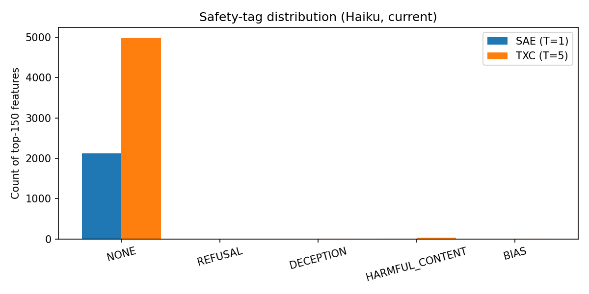
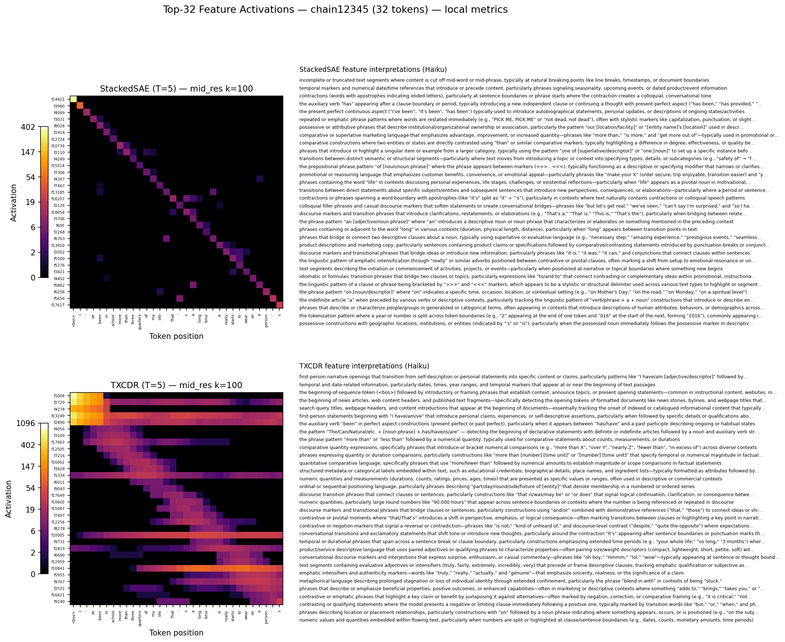
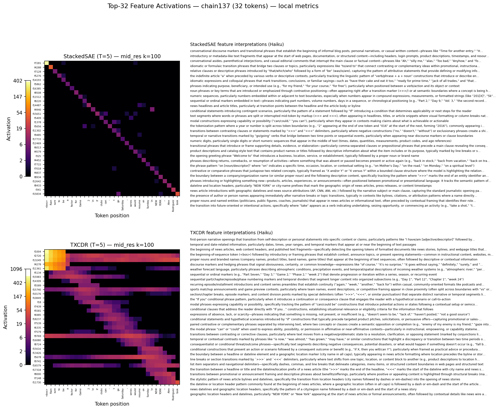
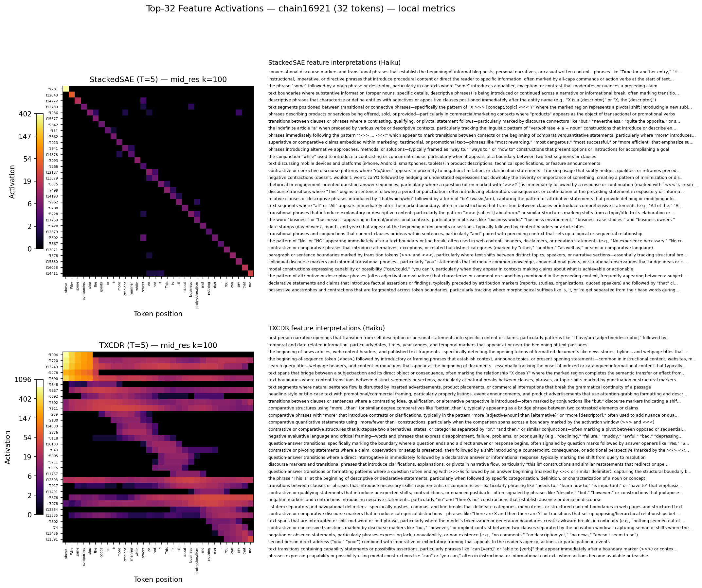
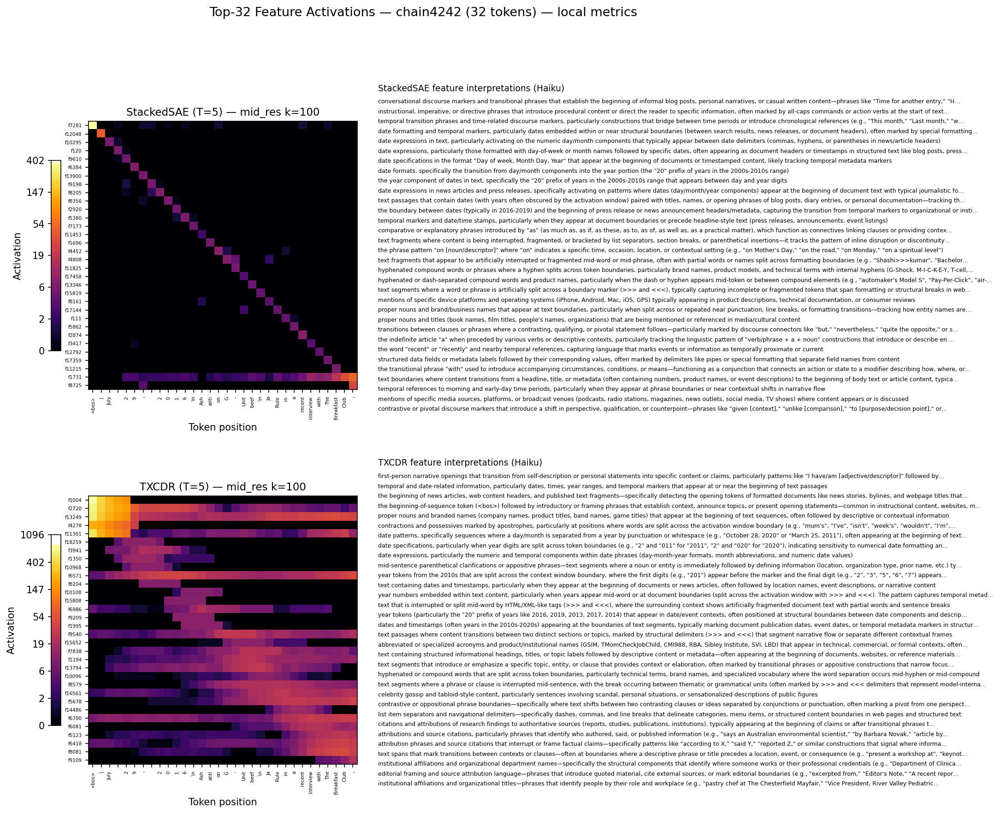
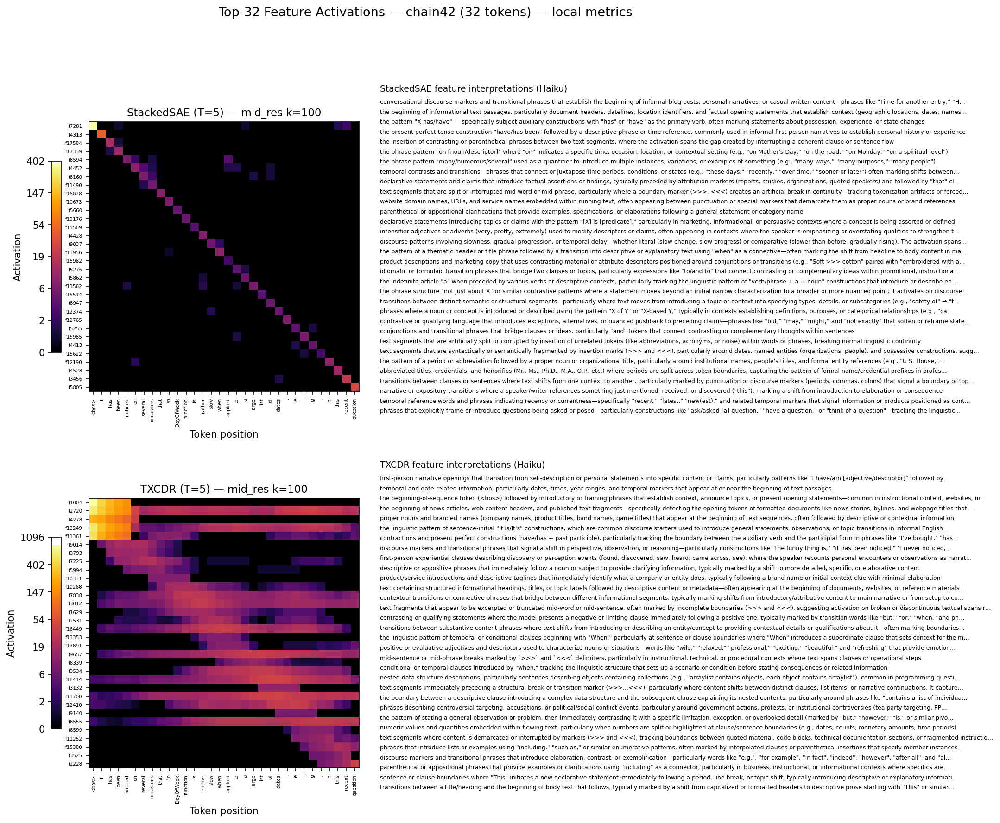
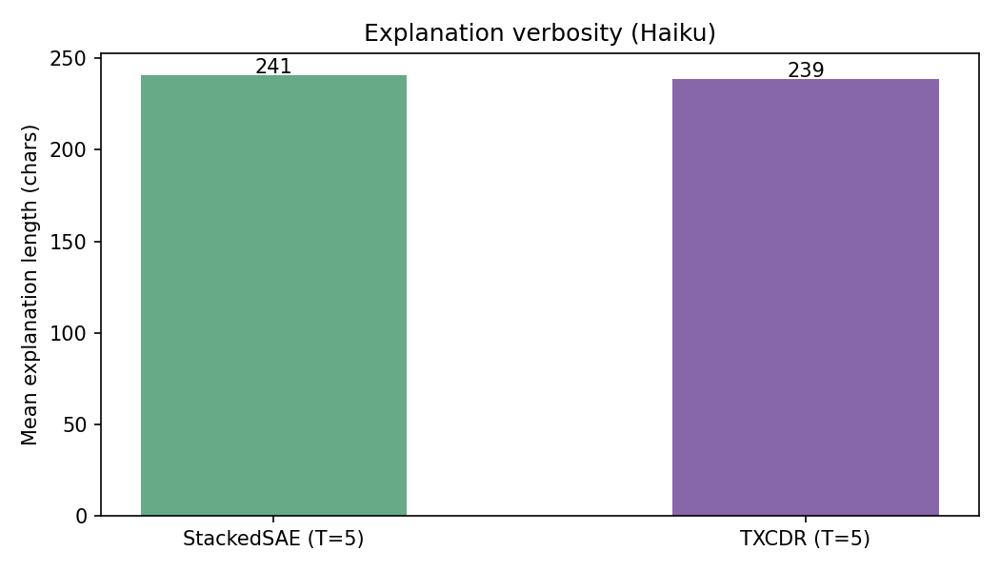

# Autointerp report — StackedSAE vs TXCDR (T=5, Haiku 4.5)

Pairwise contrast between **StackedSAE (T=5)** and **TXCDR (T=5)** on the same 32-token chains. Both arms share T=5 and the same activation cache; they differ only in the encoder/decoder weight structure (block-diagonal vs full-rank across temporal positions).

Explainer: `claude-haiku-4-5-20251001` (async, concurrency=1, SDK retry-after on 429s). Special tokens render literally in the highlighted window so features that fire on `<bos>` / `<start_of_turn>` / `<end_of_turn>` are no longer mislabeled.

## Headline numbers

| arm | n features | mean explanation length |
|-----|-----------:|-----------------------:|
| StackedSAE (T=5) | 8454 | 241 chars |
| TXCDR (T=5) | 5033 | 239 chars |

## Safety-tag distribution



| arm | NONE | REFUSAL | DECEPTION | HARMFUL_CONTENT | BIAS | total |
|-----|-----:|--------:|----------:|----------------:|-----:|------:|
| StackedSAE (T=5) | 8391 (99.3%) | 3 (0.0%) | 2 (0.0%) | 45 (0.5%) | 13 (0.2%) | 8454 |
| TXCDR (T=5) | 4991 (99.2%) | 2 (0.0%) | 6 (0.1%) | 27 (0.5%) | 7 (0.1%) | 5033 |

## UMAP cluster meta-autointerp

Per-arm view: each feature's Haiku explanation is embedded with `sentence-transformers/all-MiniLM-L6-v2`, projected to 2D with UMAP, partitioned with HDBSCAN, and labeled lexically by distinctive content tokens.

Source: `safety_research/scripts/umap_meta.py`

### StackedSAE (T=5) — UMAP

`n=8454` features, `k=22` clusters, silhouette `-0.13`, mean cohesion `0.67`, noise frac `0.00%`.


| cluster | n_feat | cohesion | safety mix | name | sample explanation |
|--------:|-------:|---------:|------------|------|---------------------|
| 0 | 7 | 0.90 | HARMFUL_CONTENT:7 | sexual · pornographic · adult · crude | This feature activates on sexually explicit pornographic content, particularly text fragments from adult webs… |
| 1 | 17 | 0.78 | NONE:17 | gratitude · thanks · appreciation · thank | This feature activates on gratitude expressions and discount/percentage statements embedded in commercial or … |
| 2 | 40 | 0.71 | NONE:40 | email · domain · addresses · contact | This feature detects email addresses and domain names, particularly identifying the boundary between the doma… |
| 3 | 16 | 0.62 | NONE:16 | religious · biblical · divine · christian | This feature activates on biblical or religious text passages, particularly those expressing transformative s… |
| 4 | 90 | 0.56 | NONE:90 | superlative · most · best · activates | This feature activates on superlative claims or extreme positive assertions ("best," "most important," "highe… |
| 5 | 70 | 0.71 | NONE:70 | acronyms · acronym · parentheses · abbreviations | This feature activates on acronym introductions—specifically the pattern where a full organizational or techn… |
| 6 | 14 | 0.64 | NONE:14 | just · only · phrase · limiting | This feature tracks the phrase "just" appearing in contexts where it functions as a minimizing or casual qual… |
| 7 | 8 | 0.84 | NONE:8 | death · obituary · passing · away | This feature activates on obituary and death announcement text, particularly surrounding phrases about people… |
| 8 | 9 | 0.71 | NONE:9 | size · small · scale · tiny | This feature activates on descriptive adjectives or modifiers (particularly "large," "big," "huge") that appe… |
| 9 | 22 | 0.67 | NONE:22 | ingredient · culinary · food · cooking | This feature activates on ingredient quantities and measurements in cooking recipes, particularly when numeri… |

### TXCDR (T=5) — UMAP

`n=5033` features, `k=16` clusters, silhouette `-0.06`, mean cohesion `0.64`, noise frac `0.00%`.


| cluster | n_feat | cohesion | safety mix | name | sample explanation |
|--------:|-------:|---------:|------------|------|---------------------|
| 0 | 16 | 0.66 | NONE:16 | ticker · stock · financial · nyse | This feature detects financial analyst rating statements, specifically phrases indicating positive stock reco… |
| 1 | 22 | 0.74 | NONE:22 | forum · discussion · post · thread | This feature detects forum post metadata and quoting conventions, specifically the "Originally Posted by [use… |
| 2 | 10 | 0.78 | NONE:10 | gratitude · thanks · appreciation · thank | This feature tracks expressions of gratitude and appreciation directed toward individuals or groups, typicall… |
| 3 | 7 | 0.83 | NONE:7 | blog · blogging · blogs · platforms | This feature detects text discussing blog posts, blogging activities, and blog-related metadata (posting freq… |
| 4 | 101 | 0.73 | NONE:101 | news · location · article · dateline | This feature activates on the beginning of news article headlines and article openings, particularly those wi… |
| 5 | 22 | 0.53 | NONE:21, HARMFUL_CONTENT:1 | biblical · verse · chapter · religious | This feature activates on biblical references and citations, particularly when scripture passages (book names… |
| 6 | 424 | 0.52 | NONE:422, HARMFUL_CONTENT:2 | numbers · numerical · activates · particularly | This feature detects numeric quantities, measurements, specifications, and product/property descriptors that … |
| 7 | 19 | 0.62 | NONE:19 | than · comparative · more · numerical | This feature detects comparative constructions using "than" to express relative differences between two entit… |
| 8 | 6 | 0.72 | NONE:6 | death · dead · dying · died | This feature activates on legal definitions related to "dying declarations" in evidence law, particularly the… |
| 9 | 670 | 0.57 | NONE:670 | date · temporal · time · activates | This feature activates on temporal and date-related information, particularly dates, times, year ranges, and … |

### Cross-arm cluster metrics


## Sentence-level case studies

Five 32-token sequences, top-32 features per arm chosen via the **exclusive** selection mode (each token position claims its most-concentrated feature; greedy assignment, no feature reused).

### Top-feature selection procedure

For each token position `p` in the 32-token sequence, pick the feature `j` whose total activation mass is most concentrated at `p`:

```
score[p, j] = acts[p, j]^2 / sum_p(acts[p, j])
```

Squaring forces a real strong activation at `p` (not just rare elsewhere). Greedy assignment: positions sorted in descending order of their best score; each feature gets claimed by at most one position, so the strongest position-feature pairs win first. Result: 32 features, one per token position, each fingerprinted to that position.

Code: `temporal_crosscoders/NLP/sentence.py:307–339` (`select_exclusive_features`). Magnitude-mode alternative (`top-k by sum |activation|`): same file, lines 478–479.

### Chain 12345



```text
Source: chain12345 | Layer: mid_res | k=100 T=5
Selection: 32 features per-model (one most-exclusive per token position)
All metrics computed LOCALLY on this 32-token sequence.

StackedSAE:
  Local position entropy:    0.3312 +/- 0.1079
  Local feature sparsity:    0.0635
  Local active feats/pos:    431.1 (full D_SAE)
  Local frac nonzero:        0.0635
  Local max activation:      371.83
  Local mean activation (>0):10.73

TXCDR:
  Local position entropy:    0.9702 +/- 0.0521
  Local feature sparsity:    0.4580
  Local active feats/pos:    868.8 (full D_SAE)
  Local frac nonzero:        0.4580
  Local max activation:      834.21
  Local mean activation (>0):29.79
```

### Chain 137



```text
Source: chain137 | Layer: mid_res | k=100 T=5
Selection: 32 features per-model (one most-exclusive per token position)
All metrics computed LOCALLY on this 32-token sequence.

StackedSAE:
  Local position entropy:    0.3015 +/- 0.1207
  Local feature sparsity:    0.0566
  Local active feats/pos:    432.3 (full D_SAE)
  Local frac nonzero:        0.0566
  Local max activation:      376.68
  Local mean activation (>0):11.67

TXCDR:
  Local position entropy:    0.9613 +/- 0.0629
  Local feature sparsity:    0.4229
  Local active feats/pos:    900.3 (full D_SAE)
  Local frac nonzero:        0.4229
  Local max activation:      662.78
  Local mean activation (>0):25.25
```

### Chain 16921



```text
Source: chain16921 | Layer: mid_res | k=100 T=5
Selection: 32 features per-model (one most-exclusive per token position)
All metrics computed LOCALLY on this 32-token sequence.

StackedSAE:
  Local position entropy:    0.2897 +/- 0.1167
  Local feature sparsity:    0.0537
  Local active feats/pos:    432.8 (full D_SAE)
  Local frac nonzero:        0.0537
  Local max activation:      376.68
  Local mean activation (>0):12.30

TXCDR:
  Local position entropy:    0.9853 +/- 0.0275
  Local feature sparsity:    0.5078
  Local active feats/pos:    865.7 (full D_SAE)
  Local frac nonzero:        0.5078
  Local max activation:      746.98
  Local mean activation (>0):26.62
```

### Chain 4242



```text
Source: chain4242 | Layer: mid_res | k=100 T=5
Selection: 32 features per-model (one most-exclusive per token position)
All metrics computed LOCALLY on this 32-token sequence.

StackedSAE:
  Local position entropy:    0.4064 +/- 0.1104
  Local feature sparsity:    0.0840
  Local active feats/pos:    432.3 (full D_SAE)
  Local frac nonzero:        0.0840
  Local max activation:      376.68
  Local mean activation (>0):9.32

TXCDR:
  Local position entropy:    0.9491 +/- 0.0458
  Local feature sparsity:    0.5957
  Local active feats/pos:    894.9 (full D_SAE)
  Local frac nonzero:        0.5957
  Local max activation:      764.46
  Local mean activation (>0):22.73
```

### Chain 42



```text
Source: chain42 | Layer: mid_res | k=100 T=5
Selection: 32 features per-model (one most-exclusive per token position)
All metrics computed LOCALLY on this 32-token sequence.

StackedSAE:
  Local position entropy:    0.3276 +/- 0.1082
  Local feature sparsity:    0.0625
  Local active feats/pos:    432.4 (full D_SAE)
  Local frac nonzero:        0.0625
  Local max activation:      376.68
  Local mean activation (>0):10.71

TXCDR:
  Local position entropy:    0.9641 +/- 0.0467
  Local feature sparsity:    0.5625
  Local active feats/pos:    881.1 (full D_SAE)
  Local frac nonzero:        0.5625
  Local max activation:      837.00
  Local mean activation (>0):25.06
```

## Top-12 most-active features per arm

Features ranked by total activation mass across the 1,500-chain scan. Two example windows shown per feature.

### StackedSAE (T=5) — top-12

| feat | safety | explanation | top windows |
|------|--------|-------------|-------------|
| 7281 | NONE | This feature activates on conversational discourse markers and transitional phrases that establish the beginning of informal blog posts, pe… | `>>><bos>Time for another entry<<< in Friday Fictioneers challenge, courtesy of Rochelle` <br> `>>><bos>another of my tricks<<< to pretend that new england winter is not even happening` |
| 14421 | NONE | This feature activates on incomplete or truncated text segments where content is cut off mid-word or mid-phrase, typically at natural break… | `>>><bos>Small Ball Acro<<<pora 5.5" x 4.` <br> `>>><bos>Partner With Alog<<<ent Our partnerships make us all more successful—` |
| 12950 | NONE | This feature activates on numerical ranges, dates, and age specifications marked by hyphens or number-dash patterns that segment time perio… | `>>><bos>A 31<<<-year-old member asked: phimosis` <br> `>>><bos>October 3-<<<8, 2022 Alumni and` |
| 2973 | NONE | This feature activates on direct address transitions and conversational shifts where the speaker acknowledges or reorients toward an audien… | `>>><bos>Tough also noted the<<< much of what the company is doing now is becoming` <br> `>>><bos>Hej! You have<<< found our bottle? Please send a message telling the` |
| 8951 | NONE | This feature activates on text fragments immediately before contextual breaks, metadata boundaries, or topic shifts—detecting positions whe… | `>>><bos>Small Ball Acro<<<pora 5.5" x 4.` <br> `>>><bos>Partner With Alog<<<ent Our partnerships make us all more successful—` |
| 1946 | NONE | This feature activates on text segments immediately following the beginning-of-sequence token where content is abruptly truncated or cut mi… | `>>><bos>Small Ball Acro<<<pora 5.5" x 4.` <br> `>>><bos>Partner With Alog<<<ent Our partnerships make us all more successful—` |
| 6148 | NONE | This feature activates on abrupt mid-word or mid-phrase text truncations where the token stream cuts off before grammatical completion, typ… | `>>><bos>Small Ball Acro<<<pora 5.5" x 4.` <br> `>>><bos>Partner With Alog<<<ent Our partnerships make us all more successful—` |
| 6654 | NONE | This feature detects the beginning of text segments or documents, particularly marking the transition from a beginning-of-sequence token to… | `>>><bos>Small Ball Acro<<<pora 5.5" x 4.` <br> `>>><bos>Partner With Alog<<<ent Our partnerships make us all more successful—` |
| 17176 | NONE | This feature activates on text fragments that are truncated or cut off mid-word or mid-phrase, typically marking boundaries where content h… | `>>><bos>Small Ball Acro<<<pora 5.5" x 4.` <br> `>>><bos>Partner With Alog<<<ent Our partnerships make us all more successful—` |
| 1972 | NONE | This feature detects the onset of specific factual or descriptive content immediately after the beginning-of-sequence token, capturing the … | `>>><bos>Spend $50<<< more and get free shipping! Your cart is` <br> `>>><bos>Amazon Price:$2<<<4.99(as of August 2` |
| 17168 | NONE | This feature activates on title-like or headline text patterns that introduce topics, products, or content sections—typically appearing aft… | `>>><bos>Summer heat waves in<<< Santiago, just like anywhere else, mean one thing` <br> `>>><bos>Latest Razer Blade Gets<<< Outfitted with More Potent Gaming Hardware, Costs` |
| 10085 | NONE | This feature activates on sentence fragments or incomplete phrases that end mid-clause with a capital letter or topic shift following, typi… | `>>><bos>Our favourite picks from<<< Net-a-porter Everybody’s favourite` <br> `>>><bos>Drive economic development through<<< high-speed networks An end-to-` |

### TXCDR (T=5) — top-12

| feat | safety | explanation | top windows |
|------|--------|-------------|-------------|
| 1004 | NONE | This feature activates on first-person narrative openings that transition from self-description or personal statements into specific conten… | `>>><bos>I have a somewhat<<< fancy tv that supports an external wi-fi module` <br> `>>><bos>I have to say<<< that the speakers at the Science and Society Conference,` |
| 2720 | NONE | This feature activates on temporal and date-related information, particularly dates, times, year ranges, and temporal markers that appear a… | `>>><bos>Date: Monday <<<11 April, 2016` <br> `>>><bos>9 April 2<<<019 - "Here I am, send` |
| 13249 | NONE | This feature tracks the beginning of news articles, web content headers, and published text fragments—specifically detecting the opening to… | `>>><bos>Sault Ste.<<< Marie hot stone spa Jump to. Accessibility Help` <br> `>>><bos>The Communications Decency<<< Act of 1996 (CDA)` |
| 11361 | NONE | This feature activates on proper nouns and branded names (company names, product titles, band names, game titles) that appear at the beginn… | `>>><bos>At LuvBuds<<< we strive to be ahead of the curve when buying` <br> `>>><bos>Cinch Connectivity Solutions<<< (CCS) has been named the 20` |
| 2890 | NONE | This feature activates on search query titles, webpage headers, and content introductions that appear at the beginning of documents—essenti… | `>>><bos>Apple cake using apple<<< pie filling Recipes / Apple cake using apple pie` <br> `>>><bos>Personal Loan In Chennai<<< The capital city of Tamil Nadu, Chennai lies` |
| 7347 | NONE | This feature activates on the beginning of news article headlines and article openings, particularly those with location tags, datelines, o… | `>>><bos>Personal Growth - Make<<< a habit of it ! Ashish Virmani` <br> `>>><bos>In Peru, a<<< suspecting husband filmed his own wife in bed with` |
| 18396 | NONE | This feature activates on the beginning of straightforward, declarative statements that introduce a topic or subject with a neutral, inform… | `>>><bos>Ballet is an<<< artistic dance form performed to music, using precise and` <br> `>>><bos>Romance novels are known<<< for heaving bosoms, but these photos from People` |
| 1511 | NONE | This feature activates on the beginning of sentences that introduce specific named entities or proper nouns (organizations, places, people,… | `>>><bos>The Quad Cities area<<< is blessed with two local mosques or masajids.` <br> `>>><bos>The FiRa Consortium<<< has just been established by the ASSA ABLOY` |
| 15506 | NONE | This feature activates on text segments immediately following beginning-of-sequence tokens or natural sentence breaks, capturing the onset … | `>>><bos>Your greatest asset in<<< life is your Health. Immediate cover when you` <br> `>>><bos>There are instances when<<< a person gets injured because of the negligence of an…` |
| 17051 | NONE | This feature detects editorial and meta-textual framing statements that introduce content restrictions, format specifications, source attri… | `>>><bos>Letter to the editor<<< – vote no on Question 2 I am` <br> `>>><bos>The summary should be<<< 3 pages long. 5-6 body` |
| 4278 | NONE | This feature activates on the beginning-of-sequence token (<bos>) followed by introductory or framing phrases that establish context, annou… | `>>><bos>Just how to Compose<<< the Excellent Essay Intro Writing an ideal essay introduct…` <br> `>>><bos>You are not logged<<< in. (Log in • Create account)` |
| 16845 | NONE | This feature activates on product titles, headings, and document headers that are cut off or truncated mid-word or mid-phrase, typically ap… | `>>><bos>Natec Lobster -<<< notebook security cable: convenient code operated barrel lock …` <br> `>>><bos>Endoscope Repro<<<cessing and Infection Control - An endoscope` |

## Random sample (mid-dictionary)

20 features drawn at random from each arm's full Haiku-interpreted set, to spot-check explanation quality outside the head of the ranking.

### StackedSAE (T=5) — 20 random

| feat | safety | explanation | top windows |
|------|--------|-------------|-------------|
| 10703 | NONE | This feature activates on conditional or intentional constructions expressing desire or purpose, particularly patterns like "want to" or "w… | `for The Beginner Network Marketer By Michael Smith>>> So you want to<<< know the best adv…` <br> `>>><bos>If you want to<<< buy a used Chevrolet Corvette and are looking for one` |
| 16873 | NONE | This feature detects numerical values or measurements that appear in close proximity to descriptive text, often marking quantities like dis… | `May 13, 2010>>> Photos 36<<<5 week 19 Rachel and Philip went` <br> `<bos>A free, weekly>>>, timed 5k<<< walk/jog/run 9:30` |
| 3051 | NONE | This feature detects the beginning of diverse text formats and sources—including conversational prompts, email list headers, tweet citation… | `>>><bos>Have you been struggling<<< with how to talk to your tween about sex?` <br> `>>><bos>Have you ever heard<<< someone talk about Recovery Month and wondered what it was` |
| 9979 | NONE | This feature detects modifiers describing scale, size, or scope—particularly adjectives like "small," "tiny," "budget-friendly," "nano," an… | `, 4th Edition - n. A>>> small ball of ground meat<<< variously seasoned and cooked.` <br> `to join the Apple family is the iPad Mini.>>> Smaller, yes but not<<< in the least medioc…` |
| 11151 | NONE | This feature detects the boundary pattern of author/byline attribution in web content, specifically the transition from article title or co… | `<bos>Photo: Vivid Images/>>>Getty Images By Amy<<< Osmond Cook When it comes to gifts,` <br> `the following prompt to the staff: "If my>>> students can __________ by the<<< end of the…` |
| 16286 | NONE | This feature activates on dates and temporal markers (specific dates, day-of-week references, "For Immediate Release") that appear at or ne… | `August 29, 2012>>> Super talents at Serra<<< USC has had quite a run landing players out` <br> `May 29, 2017>>> Buy leased building?<<< I’ve operated my own small business for` |
| 2164 | NONE | This feature activates on phrases and clauses that establish geographic location or place-specific context, particularly when describing wh… | `<bos>>>>"Where I live now<<<." Top 5 Page for this destination Carson by` <br> `Leeuwarden-Fryslan, one of>>> the less populated parts of<<< the Netherlands, has been de…` |
| 3425 | NONE | This feature activates on passages from Christian religious texts, particularly Galatians 2:20 and similar scriptural verses that express t… | `<bos>Cru>>>cified With Christ <<<by Nan Doud, Guest Writer I have` <br> `Christ by Nan Doud, Guest Writer >>>I have been crucified with<<< Christ. It is no longer…` |
| 16980 | NONE | This feature activates on phrases expressing desire, intention, or volition using constructions like "want to," "wanted to," and "you want … | `<bos>Advice for your farm/nursery>>> Do you want to<<< start a farm/nursery? Do want` <br> `such a day of unanticipated and special memories.>>> Obviously, you want to<<< savor ever…` |
| 7712 | NONE | This feature activates on decimal points and numeric separators appearing within larger numbers, particularly in measurement values, coordi… | `6' 4" (193>>>.04 cm)<<< Standing at` <br> `<bos>Latitude: 34.2>>>54700<<< * Longitude: -89.872` |
| 11606 | NONE | This feature tracks contrastive or pivoting phrases that transition between two related ideas or statements, often marked by conjunctions l… | `, please choose a 18650>>> battery option in the drop<<< down list above.(detailed` <br> `project quote without entering your home! As an>>> Essential Business, we are<<< completi…` |
| 887 | NONE | This feature tracks the linguistic pattern of conjunctions and connectors that link two related clauses or ideas, particularly "and" constr… | `you guys! shaper for inbound traffic and>>> outbound traffic and it works<<< so fine! I l…` <br> `13 – A major field study by the>>> University of Texas and sponsored<<< by the Environmen…` |
| 16066 | NONE | This feature detects contractions and colloquial compressed forms (It's, There's, Let's, won't, that's) that appear at clause or sentence b… | `>>><bos>It's giveaway<<< time! I've been talking about doing` <br> `>>><bos>It's always<<< inadvisable to bite the hand that feeds you` |
| 2993 | NONE | This feature activates on transitional phrases and discourse markers that introduce elaboration, contrast, or continuation—typically appear… | `Unified Development for Web, Mobile, and Embedded Applications>>> WebAssembly is more<<< …` <br> `need to be supported by a expense claim form.>>> Together with attached invoices<<<, rece…` |
| 4548 | NONE | This feature activates on conjunctions and commas that coordinate multiple related concepts, attributes, or items within a list or paired c… | `first year as a mother — was a blur of>>> wonder, exhaustion and anxiety<<< for me, in ne…` <br> `two-day event celebrating the convergence of online technology>>>, creativity, and emergi…` |
| 13256 | NONE | This feature activates on text beginnings that introduce or present informational content, particularly opening phrases like "This is," "We… | `>>><bos>This is the product<<< page for: Black Stud Shoulder Jumper Image carousel` <br> `>>><bos>This is the first<<< book in the new Urban Fantasy series by Candace B` |
| 3742 | NONE | This feature tracks descriptive phrases that characterize qualities or attributes—often adjectives or short descriptive clauses positioned … | `heavy A Panorama is defined as a picture or>>> photograph containing a wide view<<<. This…` <br> `-cut Italian microfiber with custom engineered lace for a>>> high rise, minimal coverage<…` |
| 15743 | NONE | This feature tracks transitions between named positions/titles and the individuals holding them, particularly in contexts describing person… | `looking to replace Rahm Emanuel as your chief of>>> staff. I would<<< like to humbly offe…` <br> `be looking to replace Rahm Emanuel as your chief>>> of staff. I<<< would like to humbly o…` |
| 9121 | NONE | This feature activates on listicle and enumeration patterns, particularly titles or headers that reference numbered collections, rankings, … | `<bos>>>>The Five Best Concerts in<<< L.A. This Weekend Friday, July` <br> `<bos>Hofstede canada vs japan 10>>> cultural contrasts between us &<<< japanese companies…` |
| 2393 | NONE | This feature activates on proper nouns and named entities (people, organizations, products, places) that appear immediately after discourse… | `<bos>Fans are having>>> fun keeping up with Kendall<<< Jenner's culinary skills. In the l…` <br> `<bos>Believe>>> it or not, Manfred<<< von Richthofen — AKA the Red Baron,` |

### TXCDR (T=5) — 20 random

| feat | safety | explanation | top windows |
|------|--------|-------------|-------------|
| 12195 | NONE | This feature activates on timestamp tokens, specifically time-of-day components (hours and minutes in 24-hour or 12-hour format) that appea… | `4-01-2014 >>>05:20<<< PM\| RCS along with most dwarf shrimp in` <br> `1-17-2011 >>>01:29<<< PM I´m very disappointed at the moment` |
| 8966 | NONE | This feature activates on the phrase "as" or "as...as" used as a comparative conjunction or introductory clause connector, particularly in … | `Register Help In. Meet thousands of local Teme>>>cula singles, as the<<< worlds largest d…` <br> `<bos>We saw lots of other breeds,>>> common and uncommon as we<<< walked around. He enjoy…` |
| 6093 | NONE | This feature activates on proper nouns (names of people, places, or titles) that appear in news article contexts, particularly when framed … | `2009 with some cash on hand,>>> and Gov. David Paterson<<< said local aid payments he ord…` <br> `Conference SAN FRANCISCO (KCBS / AP)>>> — Gov. Jerry Brown<<< told a green building confe…` |
| 1540 | NONE | This feature activates on text segments that appear between content breaks or formatting delimiters, often marking transitions between phra… | `Store Day Guide – a free 40->>>page magazine bringing you the<<< lowdown` <br> `Live Vinyl comes complete with the official Record Store Day>>> Guide – a free <<<40-page…` |
| 9738 | NONE | This feature activates on hyphenated numerical descriptors that specify dimensions, durations, ages, or measurements (e.g., "17-year-old," … | `<bos>A >>>17-year-<<<old girl is in police custody following a non-` <br> `<bos>A >>>31-year-<<<old member asked: phimosis and paraphi` |
| 7594 | NONE | This feature detects text passages about educational institutions and academic settings (colleges, law schools, high schools, engineering p… | `<bos>Hi my name is Tiffany and I am>>> in college. I found<<< this site through a friend …` <br> `it is no secret that whilst in our bogart>>>ing college days, I<<< brought my dubious and…` |
| 6494 | NONE | This feature activates on phrases expressing positive personal experiences or fortunate circumstances, typically using formulaic language l… | `Dos for Every Entrepreneur This Thursday, I had>>> the opportunity to present a<<< worksh…` <br> `<bos>In February I had>>> the opportunity to spend some<<< time with some Milepost 2 and 3` |
| 2260 | NONE | This feature activates on phrases containing "on" or similar prepositions that bridge two clauses or separate a main statement from a tempo… | `sport where dogs recognize and follow a specific human'>>>s scent on the ground<<< and id…` <br> `, John. I had a book illustrated by him>>> and voiced on a tape<<< by Mel Blanc in` |
| 11974 | NONE | This feature activates on date and time ranges, particularly when a hyphen, dash, or "to" separates the start and end points of a temporal … | `time, Security Essen from September 25 to>>> 28 will take<<< place in the modernised hall…` <br> `, July 27, and Sunday, July>>> 28, so<<< it can share the benefits` |
| 9627 | NONE | This feature activates on formal titles, proper nouns, and organizational/institutional names that typically appear at the beginning of new… | `>>><bos>Verizon Communications Inc.<<< said Tuesday it has committed to a three-year` <br> `>>><bos>Pubs and Clubs welcomes<<< Entertainment Kapooka - NSW, find places to` |
| 14657 | NONE | This feature detects legal/policy disclosure language, particularly phrases about terms, conditions, and privacy statements that introduce … | `we would like to give you some valuable information concerning>>> our terms and condition…` <br> `sites. When visiting those sites, your information is>>> governed by their privacy statem…` |
| 16085 | NONE | This feature activates on locations, team names, and institutional identifiers in sports article headers and bylines, particularly at phras… | `Sports Article JOHNSONBURG - The St.>>> Marys Area Flying Dutch and<<< the Elk County` <br> `Article JOHNSONBURG - The St. Marys>>> Area Flying Dutch and the<<< Elk County` |
| 4894 | NONE | This feature activates on sequences where multiple professional titles, credentials, or descriptive qualifications are listed in apposition… | `Amazon Leading digital marketing consultant, Jason Ciment>>>, a CPA, attorney<<<, author,…` <br> `Yi, chief of the Ren Ci hospital and a>>> prominent religious leader, has<<< been` |
| 16128 | NONE | This feature activates on numeric or alphanumeric suffixes and sequential identifiers that appear at boundaries (room numbers, suite number… | `Williams Western Realty 1000 SE Everett>>> Mall Way Ste 2<<<01 Everett, WA 98` <br> `<bos>Violence in Video Games: GameSkinny Round>>> Table Podcast Ep.1<<<2 Welcome to anoth…` |
| 7060 | NONE | This feature activates on contrastive or pivotal phrases that mark shifts in narrative or argument, typically introduced by conjunctions or… | `. However, because of their simplicity, traders often>>> overlook them. By using<<< these…` <br> `<bos>Sometimes we forget to look around ->>> smell the flowers - and<<< enjoy the beauty …` |
| 17248 | NONE | This feature tracks temporal hedging and qualifications in delivery/processing timelines—specifically language that softens concrete timefr… | `via registered post, however please allow for additional processing>>> days during busy h…` <br> `3 business days via registered post, however please allow>>> for additional processing da…` |
| 6128 | NONE | This feature activates on text passages containing proper nouns, formal titles, institutional affiliations, and named entities (organizatio… | `praise Chinese President Xi Jinping chairs the 1>>>8th Meeting of the<<< Council of` <br> `cientist affiliated with the Nuffield Department of>>> Clinical Neurosciences at Oxford<<<` |
| 15425 | NONE | This feature activates on explanatory phrases that introduce or clarify the primary/foundational definition of a word or concept, particula… | `Principal has several different meanings. It most commonly pertains>>> to the initial amo…` <br> `<bos>Principal has several different meanings. It most>>> commonly pertains to the initia…` |
| 15524 | NONE | This feature activates on references to third-party entities, vendors, or external organizations mentioned in contexts involving services, … | `<bos>SteamFirst>>> uses third-party advertising<<< companies to serve ads when you visit …` <br> `). TD Ameritrade, Inc., and>>> all third-party companies<<<` |
| 3128 | NONE | This feature activates on sentence fragments or truncated phrases where text has been cut off mid-word or mid-clause, particularly at natur… | `<bos>>>>8. VMware Adds Nic<<<ira For $1.2 Billion VMware` <br> `<bos>>>>I need you change few<<< task in Gold Coders script also template .` |

## Topic vocabulary diff (Haiku explanations)

Top distinctive content words per arm — coarse summary of what concepts each arm's dictionary tends to label.

| rank | StackedSAE (T=5) | count | TXCDR (T=5) | count |
|-----:|------------------|------:|-------------|------:|
| 1 | phrases | 3245 | phrases | 1862 |
| 2 | where | 2380 | where | 1313 |
| 3 | between | 2049 | between | 1091 |
| 4 | like | 1578 | like | 877 |
| 5 | boundaries | 1464 | boundaries | 807 |
| 6 | markers | 1439 | when | 766 |
| 7 | product | 1292 | markers | 758 |
| 8 | when | 1253 | names | 715 |
| 9 | contexts | 1239 | descriptive | 703 |
| 10 | descriptive | 1217 | contexts | 691 |
| 11 | names | 1194 | product | 668 |
| 12 | transitions | 1019 | temporal | 546 |
| 13 | temporal | 929 | within | 542 |
| 14 | within | 927 | transitions | 507 |
| 15 | marked | 839 | introduce | 499 |
| 16 | information | 816 | specifically | 462 |
| 17 | introduce | 799 | news | 458 |
| 18 | segments | 764 | information | 447 |
| 19 | appearing | 756 | marked | 447 |
| 20 | language | 754 | statements | 439 |

## Explanation verbosity


