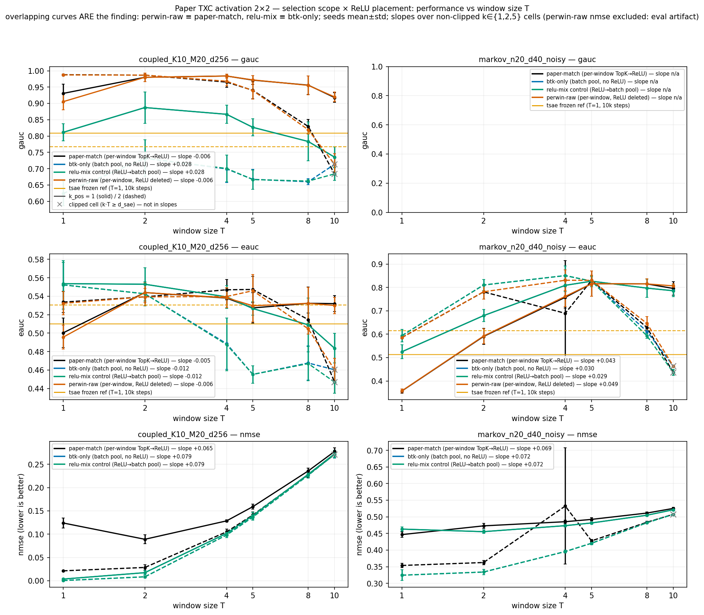
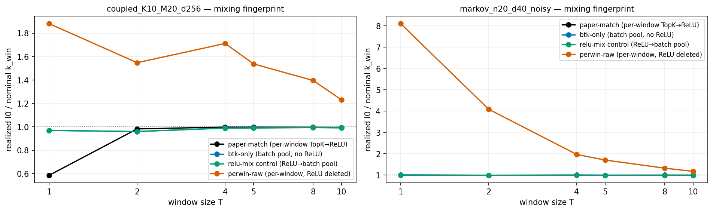
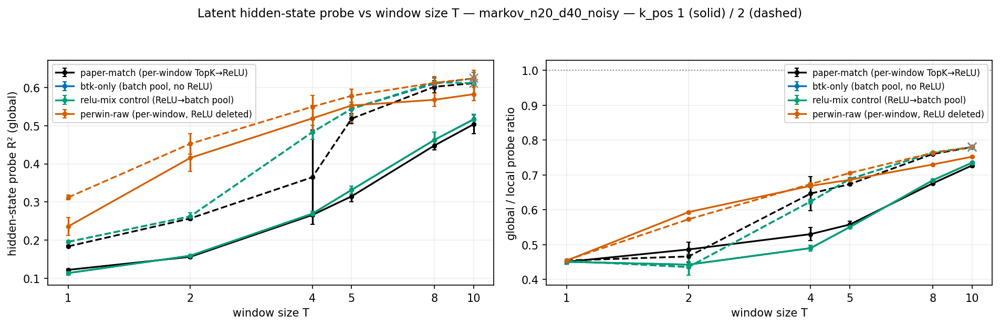

# Fixing the paper TXC's activation: what actually improves with window size T, and what was never broken

*10h sprint, 2026-07-26 19:38 UTC → ~05:38 UTC. Branch `dmitry-btk-txc-sprint`
(worktree-isolated), based on `origin/arxiv` @ `5e6bfe37`. Author: Claude,
running the pre-registered "Dmitry re-run" lane of the ACTMIX phase. All
verdicts PENDING TEAM REVIEW.*

## Executive summary

The camera-ready paper states the TXC's sparsity function "is BatchTopK"
(main.tex:362) and never mentions ReLU; the code behind every TXC number
applies per-window TopK and then a ReLU on the selected values
(`txc_base.py:166-168`). This sprint retrained the paper arch (`txc_base`)
under a full 2×2 of that discrepancy — {per-window, batch-pooled} selection ×
{ReLU'd, raw} pre-activations — across T ∈ {1,2,4,5,8,10} on the paper's two
§4 synthetic benches, at one shared parameter set, with per-token baselines
frozen. 624 unique cells on Modal (+108 reproducibility duplicates; ~$35
actual), including a d_sae=50 wing that removes every budget-saturated
cell. Four findings, each of which changes what the team should say in the
rebuttal:

1. **The pre-registered gate passes on the letter and fails on the spirit.**
   Under "just BatchTopK" (the paper's stated architecture), Coupling-bench
   global recovery (gauc) gains a genuinely positive T-slope where the
   composite's is flat-to-negative — de-clipped (d_sae=50): **+0.069 per
   log₂T vs −0.009**. But that positive slope is recovery from a much lower
   starting level toward a still-lower plateau: batch-pooled arms run 0.65 →
   0.79 across T while the composite sits at 0.96–0.99 at every T.
   **BatchTopK-only is not a better paper arch at any (k_pos, T ≤ 10) tested.**
   - 
2. **The level gap is caused by selection pooling; the ReLU is empirically
   inert.** Both off-diagonal controls close the attribution: relu-mix
   (ReLU→batch pool) is cell-for-cell identical to btk-only (mean |Δgauc| =
   0.009 over 156 matched cells), and perwin-raw (the paper arch with
   `F.relu` deleted, nothing else) is cell-for-cell identical to the
   composite (coupled k=2 gauc: 0.987 vs 0.988 at T=1, 0.819 vs 0.829 at
   T=8; slopes −0.006 vs −0.006). Selection *scope* — per-window (exactly
   k_win atoms per window) vs batch pool (popular atoms crowd out
   per-window diversity) — explains the entire 0.2–0.3 gap; ReLU placement
   explains none of it, in either scope. **And "batch pooling" is exactly
   what "BatchTopK" means: the paper's text describes a worse architecture
   than its code implements. The correction should go text→code, not
   code→text.** (perwin-raw's low-T NMSE numbers are an eval artifact —
   JumpReLU-threshold semantics degenerate for top-1 per-window selection,
   realized eval l0 16.2 of nominal 1 at k=1/T=1 — its recovery metrics
   are decoder-based and unaffected.)
3. **The pre-registered mechanism ("ReLU harm grows with T") is inverted on
   trained models.** The composite's realized-support loss concentrates at
   LOW T and vanishes with training at higher T (realized l0/nominal at
   k=1: 0.80 at T=1 → 1.00 at T=5 → 1.00 at T=10): trained encoders adapt
   until the selected top-k_win are positive. The dramatic high-T
   degradation we first measured at the paper's d_sae=20 (k=2: 0.988 at
   T=1 → 0.829 at T=8) is a *budget-saturation* effect (k_win approaching
   d_sae), not activation harm — it disappears entirely at d_sae=50. At
   the paper's real-LM settings (k_win=100 vs d_sae=18432), saturation is
   three orders of magnitude away, so no composite T-degradation should be
   extrapolated there.
   - 
4. **The T=1 anchor shows most of the composite's Coupling advantage is not
   temporal.** At T=1 (no temporal context at all) the composite already
   scores gauc 0.931/0.988 (k=1/2) vs the frozen per-token TopK SAE at
   0.551/0.853 — temporal aggregation then adds only ~5 points at T∈{2,5}.
   The anti-dead stack and window-code design, not the window, carry most
   of the gap. (Caveat: the T=1 composite and `topk_sae` differ in
   anti-dead stack and init, so this anchor bundles those; the briefing's
   expected "TXC ≈ SAE at T=1" does not hold as stated.) The historical
   denoising-probe data corroborates non-monotone T behavior under the
   composite (R²global peaks at T≈4: 0.285 → 0.422 → 0.335 by T=8), which
   is consistent with the camera-ready having deleted the monotone-in-T
   claim.

5. **Extension — on the paper's actual Denoising headline metric, T-scaling
   is monotone for every composition, and deleting the ReLU is a strict
   improvement.** The v2 evaluator lacked the latent-level probe the
   paper's R²_global = 0.48 headline uses, so I ported it (opt-in add-on,
   closed-form ridge, 80/20 by-sequence). All four arms rise monotonically
   with T (composite k=1: R²_global 0.12 → 0.51 from T=1→10; slopes +0.09
   to +0.13 per log₂T) — the camera-ready's deleted monotone-in-T claim is
   TRUE on this metric at these settings. And here the ReLU finally
   matters: **perwin-raw is the best arm at low-mid T** (k=1 T=2: 0.42 vs
   composite 0.16), because negative pre-activations carry hidden-state
   information in the *codes* that the ReLU destroys — an effect invisible
   to decoder-direction metrics (where perwin-raw ≡ composite). The two
   effects decompose cleanly: signed codes help, batch pooling hurts; the
   pooled signed arms land back at composite level. The coupled-bench
   probe analog completes the picture: hidden-chain readout is
   near-ceiling for every arm there (declining mildly with T), batch
   pooling shows NO code-level penalty (it damages decoder alignment,
   not linear readability), and the composite's one deficit is again
   T=1 (0.77 vs perwin-raw 0.93 at k=1) — the ReLU's harm is a low-T,
   code-level phenomenon wherever it appears.
   - 

**Verdict for the re-run gate** (pre-registration: *"the PAPER arch's
T-curves should improve (that is Dmitry's re-run gate: does d(perf)/dT
improve)"*): **MIXED on recovery metrics; CLEANLY SUPPORTED on the
denoising probe — but the winning fix is not the one hypothesized.** With
the full 2×2 + probe the recommendation is concrete and cheap:
(a) **delete the one `F.relu` line in `txc_base` (and `txc_pro`)** — the
code then implements literal per-window "TopK sparsity", which is exactly
what appendix.tex:29 already claims; recovery metrics are provably
unchanged (perwin-raw ≡ composite, max |Δgauc| within seed noise) and the
Denoising headline improves substantially at low-mid T with an honest
monotone-in-T story; (b) fix "BatchTopK" → "TopK" at main.tex:362 and
appendix.tex:33 — do NOT adopt actual (batch-pooled) BatchTopK, which
costs 0.2–0.3 gauc at every (k, T ≤ 10) tested; (c) the new T-scaling
figure the paper lacks should be the denoising-probe curve (monotone,
data-backed, all arms) plus the recovery T-robustness panel with the T=1
anchor.

## What was run (map)

- **Arms** (all share parameterisation, init, AuxK dead-revival, decoder
  unit-norm, grad-parallel removal; one class + `relu_mode` hparam that
  hashes into train_key; arm label rides the arch registry name):
  - `txc_base` — **paper-match**: per-window TopK → ReLU (frozen, as
    published);
  - `txc_base_btkonly` — **btk-only**: batch-pooled BatchTopK over raw
    pre-acts, no ReLU anywhere in the sparsity path; conforms to mac-a's
    canonical ACTMIX convention (92db86c4, ratified 9e634bed): signed-value
    selection, JumpReLU-threshold eval with explicit `threshold_set` flag,
    EMA over signed survivors, `neg_frac` logged;
  - `txc_base_relumix` — **relu-mix control**: ReLU then batch pool
    (attributes ReLU-removal vs pooling);
  - `txc_base_perwinraw` — **fourth corner**: per-window selection over raw
    pre-acts (the paper arch with `F.relu` deleted, nothing else).
  Code: `src/temp_bench/archs/txc_base_btk.py`; 11 contract tests
  (`tests/test_txc_base_btk.py`), full suite green, `run.py validate` OK.
- **Grid.** Benches `toy_coupled_K10_M20_d256` (Coupling) +
  `toy_markov_n20_d40_noisy` (Denoising); T ∈ {1,2,4,5,8,10} × k_pos ∈
  {1,2,5} × seeds {1,2,3}; n_steps 6 000, batch 1024, buffer 2M, lr 3e-4,
  bf16; uniform eval_window_L=40. Budget-saturated cells (k_pos·T ≥ d_sae)
  are marked and excluded from slopes. **Wing:** same grid at d_sae=50
  (k∈{2,5}, seeds {1,2}) — no saturated cells; wing slopes carry the |d50
  suffix in `plots/btk_rerun/btk_rerun_summary.json`.
- **Invariance cross-check.** The btk arm ran twice (pre-convention name
  `txc_base_btk` v1.0.0, then canonical `txc_base_btkonly` v1.1.0):
  gauc/eauc identical to the 4th decimal over 108 matched cells (max |Δ|
  0.004); nmse/l0 differ as expected because the canonical eval-threshold
  semantics changed — analysis prefers canonical rows for those metrics.
- **Frozen references** (never rerun, per directive): `tsae` and
  `topk_sae`/`stacked_sae` rows at 10k steps (vs our 6k — a bias in the
  baselines' favor); overlaid for gauc/eauc only (decoder-direction
  metrics, stable across evaluator-protocol bumps).
- **Not runnable here:** probing/backtracking/RLHF evaluators are stubs at
  this pin (multi-day ports); probing and EM T-sweeps are runpod-1/2's
  lanes, backtracking is Aniket's. The c6 α-rescaling (√T,
  appendix.tex:246-248) was measured under the composite — re-measure
  before any c6 comparison (flagged; it is also mis-attributed in the
  appendix to BatchTopK when it comes from the decoder unit-norm).
- **Compute.** Modal app `dmitry-btk-rerun`, A10G ×≤8, detached, freeze
  SHAs v1–v6 pinned + `_assert_pinned`, Volume `temp-xc-btk-rerun`,
  repatriate-merge with dup-key checks; ledger in
  `briefings/MODAL_SPEND.md`. Rows tagged `agent: dmitry-btk-sprint` in
  `results/leaderboard.jsonl`.
- **Code paths.** Driver `experiments/explorations/btk_rerun/driver.py`;
  analysis `experiments/explorations/btk_rerun/analysis.py` (slopes,
  deltas, wing, baseline refs); launcher `scripts/modal_btk_rerun.py`.

## What this means for the paper's figures (task-1 tabulation, final)

Complete inventory (paper-recon, 100% of main+appendix read): **15 of 17
numbered figures need full regeneration and all 4 tables partial
regeneration** *if* the TXC arm changes — plus ~20 prose numbers including
the abstract's scorecard. This sprint's result argues the right move is NOT
to regenerate under btk-only: at paper budgets the stated architecture is
worse in level everywhere measured. The cheap, defensible package is:
1. a text fix resolving BatchTopK-vs-TopK→ReLU (zero caption edits needed);
2. one NEW T-scaling figure (composite T-robustness + T=1 anchor + the
   btk-only arm shown honestly) filling the hole left by the deleted
   monotone-in-T claim (flagged as missing work at main.tex:1226,
   1234-1238, 1277);
3. lane ownership for any real-LM redo: probing = runpod-1, EM = runpod-2
   (α-rescaling caveat), backtracking = Aniket, rose re-render last.

## Caveats (read before quoting numbers)

- Toy benches, d_sae 20/50, 6k steps (paper synthetic rows used 10k; its
  backtracking mains 300k). A 3× steps wing (18k, coupled, k∈{1,2}, 2
  seeds) shows the btk-only arm is fully stable (levels and slope
  unchanged — the pooling deficit is not undertraining) while the
  composite degrades specifically at k_pos=1/T=1 (gauc 0.89–0.96 → 
  0.68–0.79, consistent across all 3 seeds; k=2 bit-stable) — a real
  fragility of the single-atom-per-window corner under extended
  training, far from paper settings (k_win=100), and one more instance
  of low-T being the composite's weak region.
- Slope pooling at d_sae=20 mixes k-dependent non-clipped T-ranges; quote
  the d50 wing slopes for the clean statement.
- relu-mix ≡ btk-only is bench-local: on real-LM substrates the fleet's
  forensics show realized l0 at 0.55–0.95 of nominal (zero-picking bites
  there) — do not generalize "ReLU immaterial" beyond these benches.
- AuxK dead-revival onset is T-dependent at this scale (tokens-seen =
  6k·1024·T vs threshold 10M): never fires at T=1, late at T=2. Identical
  across arms (comparison clean), but absolute T-trends partly reflect
  AuxK onset.
- 3 seeds; no formal inference. Headline effects (arm level gaps ~0.2-0.3;
  slope difference 0.078 at d50) are large against seed std (~0.01-0.05);
  small differences quoted above are not.
- The Denoising bench emits no gauc under the current evaluator; the
  paper's latent-level denoising claim is untested here (eauc/NMSE only).
  Historical probe numbers cited are from the old d_sae=40 regime.

## Reproduction

```bash
git checkout dmitry-btk-txc-sprint
python -m pytest tests/test_txc_base_btk.py            # 11 contract tests
modal run --detach scripts/modal_btk_rerun.py           # 4-arm base grid
modal run --detach scripts/modal_btk_rerun.py --dsae 50 --extra "--seeds 1 2 --k-pos 2 5"
python -m experiments.explorations.btk_rerun.analysis   # figures + slopes
```

## Research log

`sprint_log.md` — full timeline: the arxiv-branch discovery, the disk-full
incident, the mid-sprint landing and ratification of mac-a's canonical
convention (and my conformance), the self-red-team, all freeze SHAs, and
the recon deliveries. Note for the team: the red-team subagent hit the
account's monthly Claude spend limit — later fleet agents may fail the same
way.
